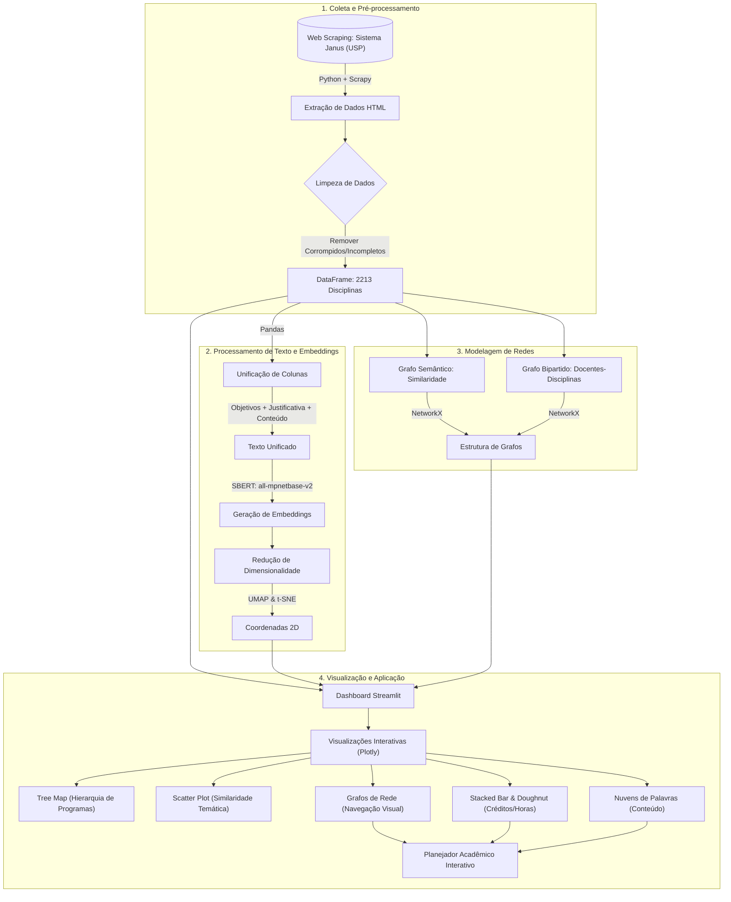

# Viz Dsiciplinas USP

Esse projeto consiste no scrap das páginas das disciplinas da pós-graduação da USP e a
visualização dos dados.




## Instalação

- Crie um ambiente virtual python através do comando `python -m venv venv`
- Ative o ambiente através do comando `source venv/bin/activate`
- Instale as dependências via o comando `pip install -r requirements-dev.txt`

## Executando o projeto

- Acesse o diretório `cd src/scraper`
- Execute `scrapy crawl janus_disciplinas -o ../../nbs/output.json`

## Analisando os dados

- Execute `jupyter-lab` na raíz do projeto, um servidor irá inicializar
- Acesse o servidor através do seu browser e navegue até a pasta `nbs` para executar os
  notebooks

## Executando o streamlit app

A aplicação streamlit tem seus dados baixados, pre-processamentos executados antes de ser
ativada. Todos esses comportamentos são encapsulados via o seguinte comando:

```
python cli.py preview
```

## Debugando

Para desenvolver os scrapers é recomendado acessar a página do Janus via o seguinte comando:

```bash
scrapy shell https://uspdigital.usp.br/janus/componente/disciplinasOferecidasInicial.jsf -s USER_AGENT='Mozilla/5.0'
```

Isso irá abrir um shell do scrapy que permitirá o usuário trabalhar com o objeto response
da biblioteca, como [demonstrado na documentação](https://docs.scrapy.org/en/latest/intro/tutorial.html#following-links).
